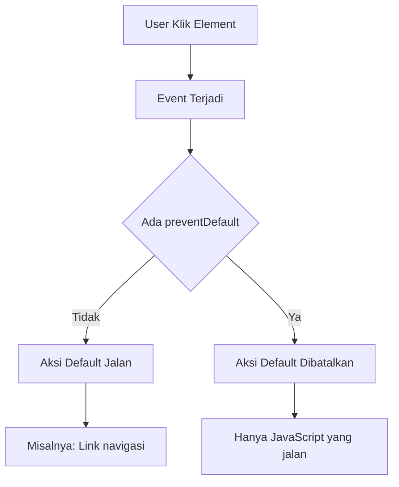

# 🚀 Memahami preventDefault() dalam JavaScript

> **Panduan lengkap untuk pemula tentang preventDefault() method dan event handling**

---

## 📋 Daftar Isi

- [🤔 Apa itu preventDefault()?](#-apa-itu-preventdefault)
- [🔍 Breakdown Sintaks](#-breakdown-sintaks)
- [⚡ preventDefault() Secara Detail](#-preventdefault-secara-detail)
- [💡 Contoh Praktis](#-contoh-praktis)
- [❌ Kapan Tidak Perlu preventDefault()](#-kapan-tidak-perlu-preventdefault)

---

## 🤔 Apa itu preventDefault()?

**preventDefault()** adalah method yang digunakan untuk **mencegah aksi default** dari sebuah element HTML ketika event terjadi.

### 🎯 Contoh Aksi Default:
| Element | Aksi Default | Efek preventDefault() |
|---------|--------------|---------------------|
| `<a href="...">` | Navigasi ke link | ❌ Tidak navigasi |
| `<form>` | Submit & refresh | ❌ Tidak submit |
| `<button type="submit">` | Submit form | ❌ Tidak submit |
| Klik kanan mouse | Show context menu | ❌ Tidak show menu |

---

## 🔍 Breakdown Sintaks

Mari kita bedah kode dari materi:

```javascript
close.forEach((element) => {
  element.addEventListener('click', (event) => {
    console.log(event.target.parentElement);
    event.target.parentElement.style.display = 'none';
    event.preventDefault(); // 🎯 Fokus utama
  });
});
```

### 1️⃣ **Variable `close`**
```javascript
close.forEach((element) => {
```
- 📦 **`close`** = Variable berisi kumpulan element HTML
- 🔄 **`forEach()`** = Method untuk mengulang setiap element
- 📝 **`(element)`** = Parameter yang mewakili setiap element saat loop

### 2️⃣ **Event Listener**
```javascript
element.addEventListener('click', (event) => {
```
- 👂 **`addEventListener()`** = Menambahkan "pendengar" event
- 🖱️ **`'click'`** = Jenis event yang didengarkan
- 📊 **`(event)`** = Object berisi informasi tentang event

### 3️⃣ **Akses Parent Element**
```javascript
console.log(event.target.parentElement);
event.target.parentElement.style.display = 'none';
```
- 🎯 **`event.target`** = Element yang diklik
- 👨‍👩‍👧 **`parentElement`** = Element induk dari yang diklik
- 🙈 **`style.display = 'none'`** = Menyembunyikan element

### 4️⃣ **preventDefault() Method**
```javascript
event.preventDefault();
```
- 🛑 **Mencegah aksi default** dari element yang diklik

---

## ⚡ preventDefault() Secara Detail

### 🎨 **Bagaimana preventDefault() Bekerja**



### 📝 **Contoh Tanpa preventDefault()**
```javascript
// ❌ Tanpa preventDefault() - Link akan tetap navigasi
document.querySelector('a').addEventListener('click', (event) => {
    alert('Link diklik!');
    // Link tetap akan navigasi ke href
});
```

### ✅ **Contoh Dengan preventDefault()**
```javascript
// ✅ Dengan preventDefault() - Link tidak navigasi
document.querySelector('a').addEventListener('click', (event) => {
    event.preventDefault(); // 🛑 Cegah navigasi
    alert('Link diklik tapi tidak navigasi!');
});
```

---

## 💡 Contoh Praktis

### 🔹 **1. Mencegah Form Submit**
```javascript
document.querySelector('form').addEventListener('submit', (event) => {
    event.preventDefault(); // 🛑 Cegah submit & refresh
    
    // Validasi manual
    const email = document.querySelector('#email').value;
    if (!email.includes('@')) {
        alert('Email tidak valid!');
        return;
    }
    
    // Submit dengan AJAX/fetch
    console.log('Form valid, kirim dengan AJAX');
});
```

### 🔹 **2. Mencegah Context Menu**
```javascript
document.addEventListener('contextmenu', (event) => {
    event.preventDefault(); // 🛑 Cegah menu klik kanan
    alert('Klik kanan dinonaktifkan!');
});
```

### 🔹 **3. Custom Modal Close**
```javascript
// Seperti contoh dalam materi
const closeButtons = document.querySelectorAll('.close-modal');

closeButtons.forEach((button) => {
    button.addEventListener('click', (event) => {
        event.preventDefault(); // 🛑 Cegah aksi default
        
        // Custom logic untuk menutup modal
        const modal = event.target.closest('.modal');
        modal.style.display = 'none';
        
        console.log('Modal ditutup');
    });
});
```

---

## ❌ Kapan Tidak Perlu preventDefault()

### 🚫 **Tidak Perlu Jika:**
- Element tidak memiliki aksi default (seperti `<div>`, `<span>`)
- Anda ingin aksi default tetap berjalan
- Event sudah dibatalkan secara otomatis

### ✅ **Contoh Tanpa preventDefault():**
```javascript
// Untuk div biasa, tidak perlu preventDefault()
document.querySelector('div').addEventListener('click', (event) => {
    // Tidak ada aksi default untuk div
    console.log('Div diklik');
    // event.preventDefault(); // ❌ Tidak perlu
});
```

---

## 🎯 Kesimpulan

| Konsep | Penjelasan |
|--------|------------|
| **preventDefault()** | Method untuk mencegah aksi default element |
| **Kapan Pakai** | Ketika ingin kontrol penuh atas behavior element |
| **Contoh Umum** | Form validation, custom navigation, modal handling |
| **Parameter** | Dipanggil dari object `event` |

---

## 📚 Tips untuk Pemula

> 💡 **Ingat:** preventDefault() adalah alat yang powerful untuk mengontrol behavior website Anda!

- 🔍 Selalu cek apakah element memiliki aksi default
- 🧪 Test dengan dan tanpa preventDefault() untuk memahami perbedaannya
- 📖 Pelajari event object properties lainnya seperti `stopPropagation()`
- 🎯 Gunakan hanya ketika benar-benar diperlukan

---

<div align="center">

**📝 Dibuat untuk pemula JavaScript | 🚀 Happy Coding!**

</div>
